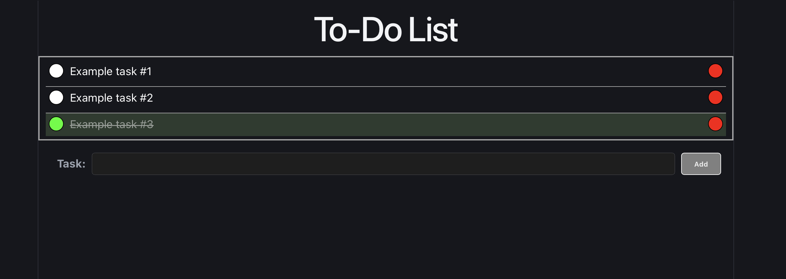

# To-Do List

A React-JavaScript to-do app with full create-read-update-delete. The app was deployed with Vercel.

**Demo Link** --> https://react-todo-omega-gilt.vercel.app

## Features 
- Add tasks via input + button, with empty-input validation
- Toggle a task complete (strike-through and green highlight) or delete it
- List renders from a single array held in state
- State management with useState

## Built with
- HTML5 / CSS3
- Vite React
- Deployed on Vercel

## What I learned
Building this app helped me learn the fundamentals of React and its importance in modern web development. Specifically I learned to:
- Manage state with the `useState` hook and keep a single source of truth
- Break a UI into small, reusable components and compose them together
- Pass data and callbacks between components via props 
- Update state immutably using the functional updater form (`.filter()`, `.map()`)
- Build controlled inputs and handle form submission and validation.